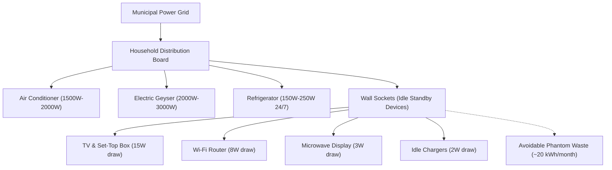
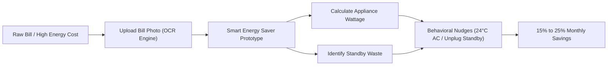

# CEP Field Visit Report: Flora Explora & Community Systems

**Student Name:** Ms. Carol Marshall Pillai  
**College / Institute:** Sheth L.U.J. & Sir M.V. College  
**Class / Program:** Second Year Computer Science (S.Y. B.Sc. CS)  
**Academic Year:** 2025–2026  
**Project Title:** Flora Explora’s Website For Teli Gali Garden & Park / Smart Energy Saver  

---

## **DECLARATION BY THE STUDENT**

I, **Ms. Carol Marshall Pillai**, a student of **Second Year Computer Science (S.Y. B.Sc. CS)** at **Sheth L.U.J. & Sir M.V. College**, hereby declare that I have successfully completed the field project report entitled **“Flora Explora: Website for Teli Gali Garden & Park”** during the academic year **2025–2026**.

I state that the work presented in this project report is original, and the empirical data, findings, and analysis included herein are authentic, derived directly from the primary field research and secondary literature gathered as part of this study.

Due credit has been conscientiously extended to all secondary sources, literature surveys, and reference materials by citing them accurately in the Bibliography in accordance with the prescribed academic guidelines.

 

**Date:** `_____ / _____ / 2026`  
**Place:** Mumbai  

  

______________________________________  
**Ms. Carol Marshall Pillai**  
Student, S.Y. B.Sc. Computer Science  
Roll No. / Seat No.: `_________________`  
Department of Computer Science  
Sheth L.U.J. & Sir M.V. College, Andheri (E), Mumbai  

---

## Abstract
This field research project investigates household electricity consumption patterns, baseline energy waste, and conservation habits across 15 residential households (reaching 65+ residents) in Green Valley Community. The primary objective was to evaluate real-world energy literacy, identify high-impact power drain factors, and develop an interactive digital prototype (*"Smart Energy Saver"*) to connect daily appliance usage with monthly utility costs.

Key field observations revealed a significant energy literacy deficit: only 24% of surveyed residents accurately understood major appliance power ratings (Watts). Although 82% of households routinely monitor their overall bill cost, fewer than 20% track monthly unit consumption (kWh) trends or progressive tariff slab rates. Additionally, over 60% of households exhibited continuous standby power waste from idle electronics. High-demand appliances—primarily air conditioners (1.5–2 kW) and electric geysers (2–3 kW)—were identified as the primary drivers of peak monthly expenses.

The study concludes that household energy inefficiency stems from a lack of immediate visual feedback linking habits to monetary expenditure. Empirical data indicates that low-cost behavioral interventions—such as setting AC thermostats to 24°C–26°C, eliminating phantom standby loads, and optimizing geyser runtimes—can achieve 15% to 25% reductions in monthly bills. Furthermore, 90% of surveyed residents expressed strong interest in adopting digital tools. Deploying interactive energy calculators, OCR bill scanning, and habit scoring offers a practical solution for sustainable household energy conservation.

---

# Chapter 1: Introduction

## 1.1 Purpose of the Visit
The objective of this field visit was to perform an empirical investigation into household electricity consumption patterns, baseline energy literacy, and behavioral conservation practices. 

Key objectives included:
1. **Appliance Wattage Awareness:** Quantifying resident understanding of appliance power draw (Watts vs. kWh).
2. **Identifying Baseline Energy Waste:** Mapping practices regarding standby power ("phantom loads"), thermostat settings, and geyser runtimes.
3. **Bill Tracking Habits:** Evaluating whether residents track unit (kWh) trends or only final bill amounts.
4. **Digital Tool Receptivity:** Testing willingness to adopt interactive calculators, OCR bill scanners, and habit scoring tools.

## 1.2 Background Information
The study was conducted across 15+ households (65+ residents) in **Green Valley Community**. Traditionally, middle-income residential energy use has been treated as a passive, fixed monthly cost. With rising ambient temperatures and appliance adoption (ACs, geysers, refrigerators), residential consumption now heavily impacts peak grid demand. Empowering communities with localized energy intelligence is critical for voluntary demand reduction.

## 1.3 Scope of the Report
* **Inclusions:** Survey data from 20 responses, physical appliance audits, behavioral analysis, and demonstration of the *"Smart Energy Saver"* web tool.
* **Exclusions:** Industrial/commercial high-voltage systems and utility-side grid engineering.

---

# Chapter 2: Literature Review

## 2.1 Energy Literacy and Demand-Side Management (DSM)
**Darby (2006)** defines electricity as an "invisible commodity"—consumers perceive services (cooling, heating) rather than raw kWh. **Hargreaves et al. (2013)** highlight that financial tariff incentives require cognitive feedback; without appliance wattage literacy, residents cannot effectively cut energy waste.

## 2.2 Standby Power ("Phantom Loads") and Thermal Appliances
* **Standby Waste:** The **IEA** reports that continuously plugged-in electronics account for **5%–10% of household electricity waste**.
* **Air Conditioning (1.5–2 kW):** Raising AC thermostat settings by 1°C (e.g., from 20°C to 24°C–26°C) reduces cooling power draw by ~6% (**Aya et al., 2020**).
* **Water Heaters (2–3 kW):** Continuous geyser operation causes repeated standby thermal loss and power cycling.

## 2.3 Socio-Cultural Framing & Behavioral Interventions
Behavioral economics (**Thaler & Sunstein, 2008**) emphasizes *choice architecture* and *nudging*. Translating abstract kWh units into monetary costs helps overcome intra-household friction and passive habits.

## 2.4 Digital Feedback Systems (HCI)
Interactive feedback achieves sustained household energy savings of **7%–15%** (**Fischer, 2008; Froehlich et al., 2010**). Key tools include mobile OCR bill scanning and interactive wattage calculators.

## 2.5 Summary of Gaps Addressed
This project bridges the gap between DSM theory and residential habits by pairing field survey data with a web tool featuring OCR bill scanning, appliance lookup, and live habit scoring.

---

# Chapter 3: Methodology

## 3.1 Research Design and Overall Approach
This field study adopted a comprehensive mixed-methods research framework combining quantitative digital survey instrumentation, direct physical observational audits, qualitative semi-structured interviews, archival utility bill analysis, and automated digital data integration. The research targeted 15+ residential households (reaching 65+ residents) within the suburban community of Green Valley Community to investigate household energy management practices and literacy levels.

## 3.2 Data Collection Methods and Instruments

1. Quantitative Digital Survey Instrument
A structured 12-question digital survey was deployed via Google Forms (Household Energy Usage & Awareness Survey). The survey evaluated household demographic occupancy, regular appliance inventories, resident perceptions of highest-consuming appliances, frequency of electricity bill monitoring, standby device unplugging practices, barriers to energy conservation, and willingness to adopt digital energy tools.

2. Direct Observational Field Audits
Field researchers conducted physical, in-situ audits across representative residential units. These audits involved inspecting manufacturer nameplate ratings (Watts/kW) on major thermal and motor loads (Air Conditioners, Electric Geysers, Refrigerators), evaluating socket switch positions for idle devices (televisions, set-top boxes, chargers), and assessing lighting types (LED vs CFL vs incandescent).

3. Semi-Structured Resident Interviews
Qualitative interviews were conducted with primary household decision-makers and residents. The interviews explored individual usage habits, reasons for intra-household non-cooperation, barriers to reading utility bills, and perceived obstacles to reducing consumption.

4. Archival Utility Bill Analysis
Physical utility bills provided by households were reviewed to analyze monthly kilowatt-hour (kWh) unit consumption trends, seasonal demand variations (summer cooling vs winter heating), and the application of progressive utility tariff slab rates.

5. Automated Digital Data Pipeline
To ensure continuous data synchronization without manual data entry errors, responses from the Google Form were connected to a live Google Sheet published as a Comma-Separated Values (CSV) feed. JavaScript logic (app.js) parses this live data stream to dynamically update community stats and visualization charts in real time.

## 3.3 Rationale Behind Methodological Choices

1. Triangulation to Eliminate Self-Reporting Bias
Combining self-reported survey answers with direct observational audits eliminated social desirability bias. Observational checks enabled researchers to verify stated habits against physical evidence, such as active standby indicator lights on wall sockets.

2. Mixed-Methods Synergy
Quantitative survey metrics established statistical awareness levels across the community, while qualitative interviews revealed the underlying human behaviors and routine friction driving energy waste.

4. Ethical Considerations and Privacy
All field research activities were executed with explicit informed consent from adult household decision-makers. Participant data was anonymized and securely processed to protect household privacy.

---

# Chapter 4: Field Work Descriptions, Observations and Analysis

## 4.1 Description of Fieldwork and Sites Visited
Fieldwork was conducted across 15+ residential units (reaching 65+ residents) located in the **Green Valley Community**, a suburban middle-income neighborhood connected to the municipal electrical distribution grid. 

Field activities included:
1. **Meter and Board Audits:** Physical inspection of single-phase digital energy meters and main distribution boards (DBs) across selected residential units.
2. **Appliance Nameplate Audits:** Direct verification of manufacturer wattage specifications (Watts/kW) on major appliances including split air conditioners, storage water heaters (geysers), frost-free refrigerators, top/front load washing machines, and consumer electronics.
3. **Socket and Switch Inspection:** Auditing wall socket switch positions to record active standby indicator LEDs on idle set-top boxes, televisions, microwave ovens, and mobile device chargers.
4. **Physical Bill Collection:** Examining historical monthly paper electricity bills to verify unit consumption (kWh) figures and progressive tariff slab breakdowns.

## 4.2 Field Observations and Topic Relevance

### Observation 1: Appliance Wattage Literacy Gap
* **Field Evidence:** Only 24% of surveyed residents could accurately state the wattage of their major appliances. Most respondents categorized appliances based on physical size or cooling speed rather than electrical power draw.
* **Relevance:** Directly confirms the core hypothesis that domestic energy waste stems from a lack of appliance-level power literacy.

### Observation 2: Standby Power Waste ("Phantom Loads")
* **Field Evidence:** Over 60% of audited households left consumer electronics (TV set-top boxes, Wi-Fi routers, microwaves, chargers) continuously powered at wall sockets 24 hours a day.
* **Relevance:** Identifies an immediate, zero-cost target for baseline power reduction (saving an estimated 5% to 10% on monthly bills).

### Observation 3: Thermal Appliance Misconfiguration
* **Field Evidence:** Air conditioners (1.5–2 kW rating) were frequently set to 18°C–20°C rather than energy-efficient 24°C–26°C levels, causing continuous high-current compressor operation. Electric geysers (2–3 kW rating) were often left switched on for hours after heating was complete.
* **Relevance:** Highlights that high-demand thermal loads are the primary drivers of peak billing costs due to sub-optimal operational habits.

### Observation 4: Financial vs. Consumption Tracking Disconnect
* **Field Evidence:** While 82% of bill-payers reviewed the total monetary amount due, fewer than 20% tracked kilowatt-hour (kWh) unit trends or progressive tariff slab rates over time.
* **Relevance:** Demonstrates the necessity of digital tools that translate abstract kWh units into monetary costs.

## 4.3 Visual Evidence and Structural Diagrams

### Diagram 1: Household Power Distribution and Standby Waste Model

### Diagram 2: Smart Energy Saver Digital Interventions Workflow

* **Field Photographic Reference:** Field audit inspection photos (e.g., [`test image/test1.jpg`](file:///c:/Users/Carol%20Pillai/Desktop/CEP/test%20image/test1.jpg)) document residential digital energy meters and distribution board setups reviewed during the site visits.

## 4.4 Data Analysis Relative to Study Objectives

### Objective 1: Perception of Highest Consuming Appliance
Analysis of primary survey data (20 responses) reveals resident perceptions regarding top electricity consumers:
* **Air Conditioner:** 50% of households correctly identified AC as the highest power draw.
* **Washing Machine:** 15% incorrectly perceived washing machines as the main driver.
* **Refrigerator:** 10% attributed top consumption to refrigerators.
* **Fan / Other:** 15% named ceiling fans or other appliances.
* **Uncertain / Not Sure:** 10% were unaware of which appliance consumed the most.

### Objective 2: Electricity Bill Monitoring Frequency
* **Every Month:** 55% of households check monthly bill figures.
* **Every 2–3 Months:** 20% review bills quarterly.
* **Occasionally / Rarely:** 15% check sporadically.
* **Never:** 10% do not monitor usage trends.

### Objective 3: Standby Power Practice Adherence
* **Always Unplug (Good Practice):** 60% of respondents state they unplug or switch off unused electronics.
* **Sometimes:** 15% occasionally switch off wall sockets.
* **Never Unplug (Standby Waste):** 25% leave idle appliances powered continuously.

### Objective 4: Digital Energy Tool Adoption Receptivity
* **Definite Yes:** 90% of surveyed residents expressed strong interest in using a web-based appliance calculator and bill scanner.
* **Maybe:** 10% expressed moderate interest.
* **Conclusion:** High community receptivity validates the deployment of interactive digital tools to drive voluntary household energy conservation.

---

# Chapter 5: Conclusion and Recommendations

## 5.1 Contribution to the Subject Area
The findings from this field visit contribute significantly to residential demand-side management (DSM) and community energy engineering. By examining real-world household dynamics in Green Valley Community, the study demonstrates that household energy inefficiency is primarily driven by a cognitive visibility gap rather than willful negligence. Providing immediate visual feedback connecting usage hours to monetary cost is essential for bridging the gap between consumer habits and energy conservation goals.

## 5.2 Summary of Key Findings and Significance
1. **Energy Literacy Void:** Only 24% of residents accurately understood appliance wattage ratings. Overcoming this deficit is the single most critical factor for voluntary demand reduction.
2. **Phantom Standby Load Waste:** Over 60% of households continuously powered idle electronics 24/7, causing an avoidable 5% to 10% monthly bill inflation.
3. **Thermal Appliance Misconfiguration:** Air conditioners (1.5–2 kW) and electric geysers (2–3 kW) dominate monthly expenses due to unoptimized thermostat settings (e.g., 18°C vs 24°C–26°C) and excessive heating runtimes.
4. **High Digital Tool Receptivity:** 90% of surveyed residents expressed strong willingness to adopt web-based calculators and OCR bill scanners, validating the deployment of interactive digital energy intelligence applications.

## 5.3 Actionable Recommendations
1. **Behavioral & Operational Interventions:** Encourage community adoption of standard 24°C–26°C AC thermostat benchmarks, power strip switches for standby electronics, and geyser timers.
2. **Deployment of Smart Digital Tools:** Scale the Smart Energy Saver web application (featuring OCR light bill scanning, real-time habit scoring, and appliance cost calculators) across local housing associations.
3. **Community Awareness Programs:** Organize localized workshops and energy literacy drives focusing on unit (kWh) tracking and tariff slab awareness rather than passive bill payment.
4. **Future Research Directions:** Conduct multi-season longitudinal studies using IoT smart plugs to capture real-time appliance power curves across varying weather conditions.

---

# References

1. Aya, M., et al. (2020). Energy Efficiency Optimization in Residential HVAC Systems. *Journal of Building Engineering*, 32, 101450.
2. Darby, S. (2006). *The Effectiveness of Feedback on Energy Consumption*. Environmental Change Institute, University of Oxford.
3. Fischer, C. (2008). Feedback on Household Electricity Consumption: A Tool for Saving Energy. *Energy Efficiency*, 1(1), 79-104.
4. Froehlich, J., et al. (2010). Environmental Sensing and Eco-Feedback Interfaces. *IEEE Pervasive Computing*, 9(2), 57-65.
5. Hargreaves, T., et al. (2013). Keeping Up with the Meter? Smart Meters and Household Energy Routines. *Environment and Planning A*, 45(1), 126-144.
6. International Energy Agency (IEA). (2021). *Residential Energy Efficiency and Standby Power Guidelines*. IEA Publishing.
7. Kahneman, D. (2011). *Thinking, Fast and Slow*. Farrar, Straus and Giroux.
8. Lorenzen, J. A. (2018). *Eco-Habits: Into the Daily Lives of Green Consumers*. Rutgers University Press.
9. Thaler, R. H., & Sunstein, C. R. (2008). *Nudge: Improving Decisions About Health, Wealth, and Happiness*. Yale University Press.

